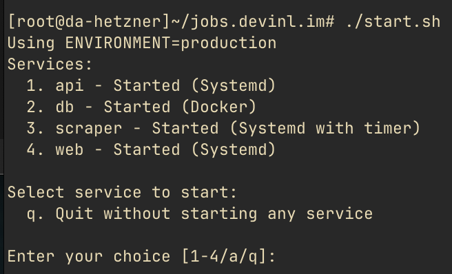

# THIS README IS A LITTLE OUT OF DATE!!

## Description

While applying, it's good to apply to recently posted jobs but searching for them manually across multiple sites gets old. 

Sometimes these job sites do let you setup notifications, but even then the implementation is inconsistent.

There are browser extensions that automatically watch for changes, but that still feels clunky. 

There is a site that do this: [JobRadar](https://www.jobradar.live/) but it seems that they're missing a lot of companies and is not user-configurable.

So I want to make a similar site except that users can set their own sites and keywords to monitor, with all configuration data saved locally in caches (export will be allowed).

## Quickstart 

Install uv 

```
# MAC
brew install uv

# Fedora
sudo dnf install uv
```

Then run this init script on first run 

```
./init.sh
```

Now you can use the start script and follow its instructions

```
./start.sh
```



NOTE 1: Ollama is currently not being used, since using smaller local models results in bad parsing. 

## Design


Next good-to-haves:
- Location filter 
- Browser notification
- Team/Category filtering

## System Architecture


Design choices:
- User config stored in client (exportable).
- API service handles requests, email/browser notifications, and scraper scheduling
- Postgres stores scraped content, page hash, and scraping history
- Scraper first does a diff detect on page hash. If page has changed, it will use llm-scraper with local ollama to parse.
- Ollama will be used to host SmolLM 1.7B.
- SmolLM should let us scrape more reliably from any website without having to manually configure rules for each site.

## TODO 

- Fix docs to mention crawl4ai instead of llm-scraper
- Update docs architectures and guide
