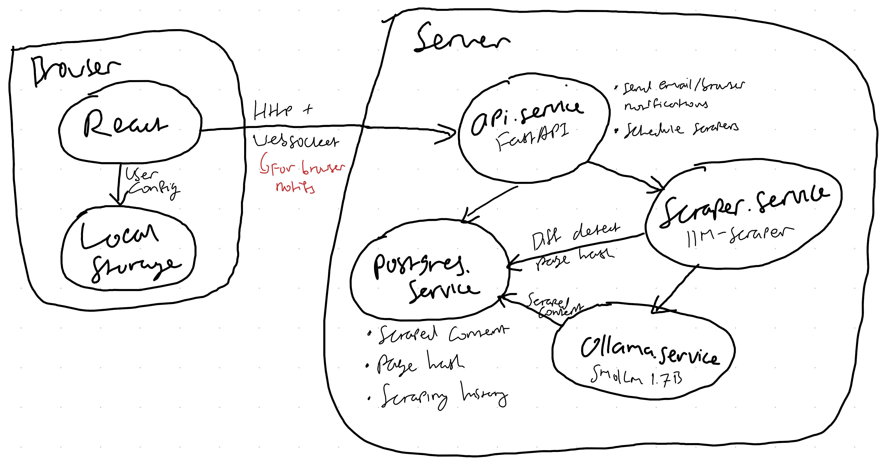

## Description

While applying, it's good to apply to recently posted jobs but searching for them manually across multiple sites gets old. 

Sometimes these job sites do let you setup notifications, but even then the implementation is inconsistent.

There are browser extensions that automatically watch for changes, but that still feels clunky. 

There is a site that do this: [JobRadar](https://www.jobradar.live/) but it seems that they're missing a lot of companies and is not user-configurable.

So I want to make a similar site except that users can set their own sites and keywords to monitor, with all configuration data saved locally in caches (export will be allowed).

## Design

Next good-to-haves:
- Location filter 
- Browser notification

## System Architecture

